## Editor Paint

Use o editor Paint para criar seus próprios cenários e trajes e para editar cenários e trajes existentes.

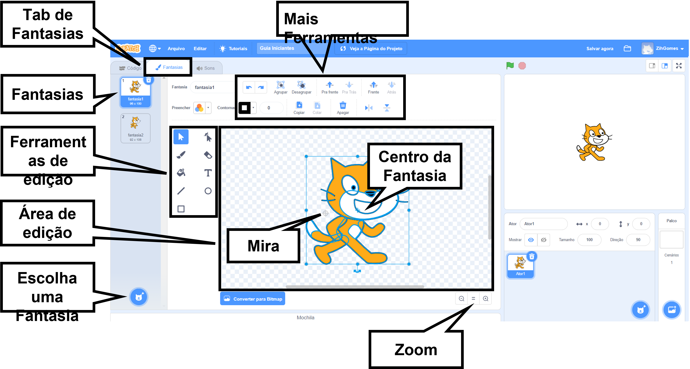{:width="600px"}

[[[scratch3-paint-a-new-backdrop-extended]]]

[[[scratch3-backdrops-and-sprites-using-shapes]]]

[[[scratch3-use-text-tool]]]

[[[scratch3-add-costumes-to-a-sprite]]]

[[[scratch-crosshair]]]

[[[scratch3-copy-parts-between-sprite-costumes]]]

--- collapse ---
---
title: Duplique e edite uma fantasia para usar em uma animação
---

Alguns atores do Scratch têm apenas um traje, ou têm várias roupas que não funcionam como uma animação. Se você escolher um traje, duplique ele (faça uma cópia dele) e faça uma pequena mudança, isso pode criar um efeito de animação.

**Animação de robô**: [Ver interior](https://scratch.mit.edu/projects/436260207/editor){: target = "_ blank"}

  <iframe allowtransparency="true" width="485" height="402" src="https://scratch.mit.edu/projects/embed/436260207/?autostart=false" frameborder="0"></iframe>

Vá na aba **Fantasias** para o seu ator.

Escolha o traje que você quer usar, então delete os outros trajes, porque você não vai precisar deles para sua animação. Por exemplo o ator **Robô** vem com trajes para três diferentes robôs, então você deve escolher um dos trajes e deletar os outros.

Dê um duplo clique (ou em um tablet, toque e segure) sobre o traje, e escolha **duplicar**.

Faça pequenas alterações na cópia do traje. Por exemplo, você pode mover, rotacionar, ou mudar todo ou parte do traje. Você também pode adicionar linhas de movimento.

Se o seu traje usa gráficos vetoriais, você pode selecionar partes de um traje e alterar cada parte separadamente.

Você pode duplicar o traje de novo e fazer mais mudanças para adicionar mais quadros à sua animação.

Agora você pode usar seus trajes em uma animação simples.

--- /collapse ---

--- collapse ---
---
title: Use a ferramenta Preencher para mudar a cor de um traje
---

Você pode mudar a cor do seu ator. Primeiro, selecione o ator na lista de atores abaixo do Palco e então clique sobre a aba **Fantasias**.

Use a ferramenta **Selecionar** (Seta) para destacar a parte do traje que você quer alterar a cor.

{:width="200px"}

{:width="300px"}

Vá para **Preencher** e selecione uma cor. Isso vai automaticamente encher a forma com a qual que você selecionou.

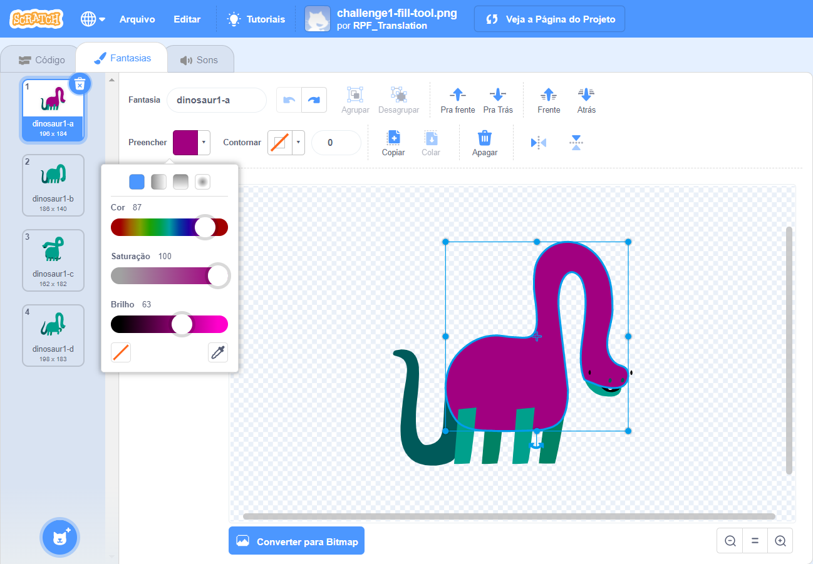{:width="300px"}

Repita os passos acima para qualquer parte do traje que você tiver esquecido, ou para qualquer outra parte do traje que você também queira alterar a cor.

{:width="300px"}

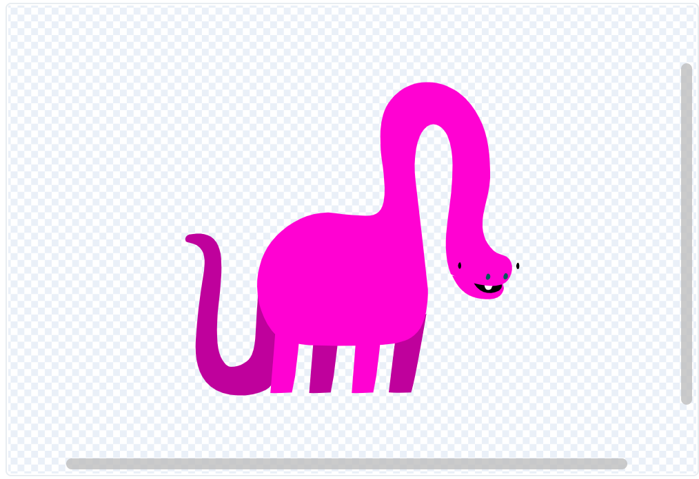{:width="300px"}

{:width="300px"}

--- /collapse ---

Use as dicas abaixo para ajudar você a criar seus próprios designs para os atores no editor Paint.

--- collapse ---
---
title: Criar cenários como se fossem atores
---

**Colina como um ator**: [Ver interior](https://scratch.mit.edu/projects/452582516/editor){: target="_ blank"}

{:width="400px"}

Para fazer o seu próprio ator **Colina**, mostrado no exemplo acima, você pode usar as ferramentas **Círculo** e **Retângulo** no editor Paint:

+ Vá para **Selecione um Ator** e selecione **Pintar** para criar um novo traje.

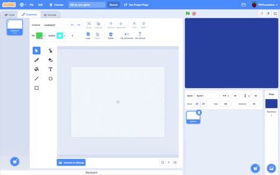{:width="400px"}

+ Escolhe uma cor para **Preencher**. Clique em **Contornar** e o desmarque (para fazer isso, clique sobre a caixa com uma linha diagonal no canto inferior esquerdo do menu). Agora, use a ferramenta **Círculo** para desenhar uma forma oval. Em seguida, selecione a ferramenta **Retângulo** e desenhe um retângulo abaixo do círculo oval.

+ Se você usar cores variadas para as formas, pode ser necessário usar as ferramentas **Frente** e **Atrás** no editor de Pintura para mover suas formas para frente ou para trás, de modo que sejam posicionadas corretamente no plano de fundo.

+ Você pode selecionar todas as formas e **Agrupar** todos eles para que você possa ajustá-los ou movê-los como uma forma.

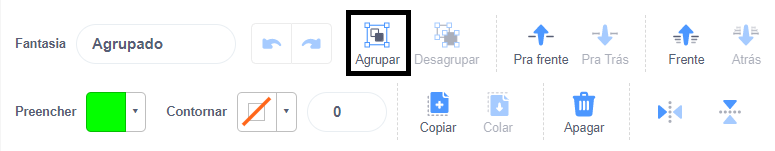{:width="400px"}

Agora, faça outros atores para o seu cenário, se isso se encaixa na sua ideia de projeto.

Lembre-se de nomear seu (s) ator (es).

--- /collapse ---

--- collapse ---
---
title: Use a ferramenta Linha para criar um triângulo
---

Você pode criar polígonos, como um triângulo, e usar essas formas para criar telhados ou montanhas.

Vá para **Selecione um Ator** e selecione **Pintar** para criar uma nova fantasia para o ator. Neste exemplo, você fará casas.

**Casa**: [Veja interior](https://scratch.mit.edu/projects/453595663/editor){: target = "_ blank"}

{:width="400px"}

Se você seguir as instruções abaixo, poderá usar a ferramenta **Linha** para criar qualquer forma:
+ Escolha uma cor para **Preencher**. Para escolher a cor preta, diminua o **Brilho** para zero (`0`).

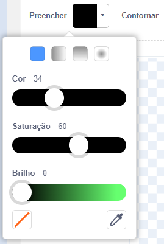{:width="150px"}

+ Selecione **Sem contorno**.

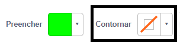{:width="200x"}

+ Use a ferramenta **Retângulo** para desenhar um retângulo.
+ Use a ferramenta **Linha** para desenhar um triângulo. Certifique-se de completar o triângulo, caso contrário, ele não será preenchido com cor.
+ Mova as duas formas juntas.
+ Selecione a ferramenta **Preencher** (Bucket) e preencha o triângulo com a cor.
+ Use a ferramenta **Retângulo** para desenhar outro retângulo para a chaminé.
+ Você pode usar as ferramentas **Frente** e **Atrás** no editor de Pintura para mover suas formas para frente ou para trás, de modo que sejam posicionadas corretamente. Neste exemplo, você não precisará fazer isso, porque as formas são pretas para fazer uma silhueta.
+ Selecione todas as formas e clique em **Agrupar** todas elas para que você possa ajustá-las ou movê-las como uma só forma.

Para criar formas duplicadas de sua casa (por exemplo, para fazer um horizonte), siga as dicas em **Duplique formas para criar um cenário** abaixo.

--- /collapse ---

--- collapse ---
---
title: Duplique formas para criar um cenário
---

Você pode querer duplicar formas dentro de uma fantasia para que seu cenário pareça mais movimentado ou cheio.

**Nuvens**: [Veja interior](https://scratch.mit.edu/projects/447278432/editor){: target = "_ blank"}

{:width="400px"}

O efeito de multiplicação de formas é usado por animadores profissionais para criar a impressão de padrões climáticos, como chuva ou nuvens; um aglomerado de objetos, como edifícios ou uma madeira; ou uma multidão de pessoas em uma cena.

--- no-print ---

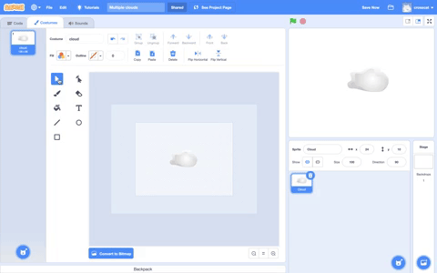

--- /no-print ---

Para multiplicar qualquer tipo de forma:
+ Vá para **Selecione um Ator** e selecione, neste exemplo, o ator **Nuvem**
+ Na aba **Fantasias**, use a ferramenta **Selecionar** para destacar toda a forma
+ Use as ferramentas **Copiar** e **Colar** para criar duplicatas da forma
+ Use a ferramenta **Selecionar** para mover a forma dentro do editor de Pintura
+ Você pode variar o tamanho das formas para ajudar a criar uma maior sensação de efeitos 3D, por exemplo
+ Você pode selecionar todas as formas e **Agrupá-las** de modo que tais formas possam ser ajustadas e movidas como uma só forma

--- /collapse ---

--- collapse ---
---
title: Use Saturação e Brilho para criar profundidade
---

No mundo real, os objetos que estão mais distantes parecem mais claros. Para obter um cenário 3D mais realista, você pode **diminuir** a cor de **Saturação** e/ou **Brilho** de cada ator para que eles apareçam cada vez mais distantes.

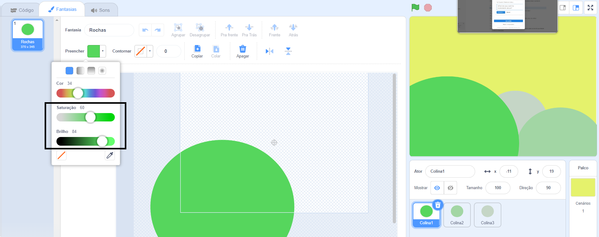{:width="400px"}

--- /collapse ---

--- collapse ---
---
title: Crie um ator com lacunas que você possa ver através
---

Você pode criar um ator que tenha lacunas que você possa ver através. Se estiver posicionado como a camada frontal e tiver o tamanho do Palco, pode aparecer como uma vista através das barras de uma gaiola ou janela.

--- no-print ---

**Leão enjaulado**: [Veja interior](https://scratch.mit.edu/projects/445680159/editor){: target = "_ blank"}

--- /no-print ---

Para criar um tipo de ator de mascaramento:
+ Vá para o menu **Selecionar cenário** e escolha a opção **Pintar**
+ Escolha uma cor de**Preenchimento** sem **Contorno** e desenhe um retângulo vertical
+ Use as ferramentas **Copiar** e **Colar** para criar duplicar a forma
+ Use a ferramenta **Selecionar** para mover a forma
+ Conforme você posiciona suas formas, certifique-se de que elas estejam tocando a borda do Palco para se encaixar com sua ideia de projeto

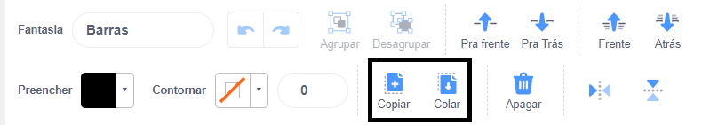

--- /collapse ---

**Dica:** Se você achar difícil gerenciar os atores em seu Palco, como ter um ator grande que continua cobrindo um ator menor, você pode clicar em **Esconder** para que você não veja um ator ou atores. Então, quando terminar, clique em **Mostrar** novamente.

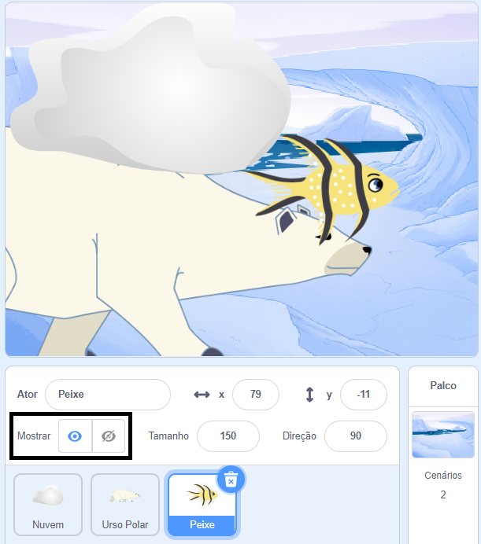{:width="300px"}
