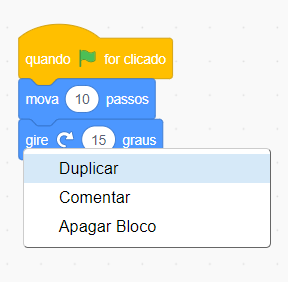
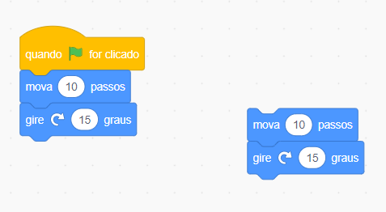

## Dicas de edição
É útil aprender como copiar e excluir blocos de código e duplicar atores.

**Dica:** Você pode usar <kbd>Ctrl-z</kbd> (mantenha pressionada a tecla Ctrl e toque em 'z') para desfazer muitas ações no Scratch. Se você acidentalmente excluir um Ator ou outro item, você pode usar **Restaurar** no **Editar** do menu para recuperá-lo.

Você pode excluir blocos de código de que não precisa mais:

[[[scratch-delete]]]

Duplicar ou copiar o código pode economizar tempo ao fazer um projeto.

--- collapse ---
---
title: Blocos duplicados
---

Blocos duplicados ou conjuntos de blocos para reutilizar no programa de um ator:

* Vá para a guia **Código**.
* Clique com o botão direito (ou, em um tablet, toque e segure) no primeiro bloco que você deseja copiar. Ele também selecionará todos os blocos abaixo dele.
* Selecione **Duplicar** no menu suspenso. {: largura = "300px"}
* Arraste o código duplicado para onde você deseja que ele vá. {: largura = "300px"}
* Exclua todos os blocos de que você não precisa.

--- /collapse ---

[[[scratch3-duplicate-sprite]]]

Crie um novo ator e copie todo ou parte do código do primeiro ator.

--- collapse ---
---
title: Copie o código de um ator
---

No canto inferior direito da lista de Atores, clique em **Selecione um Ator** e selecione o ator que deseja adicionar.

Clique no primeiro ator e vá para a guia **Código**. Arraste o código que está na área de código do primeiro ator para a imagem do segundo ator na lista de atores, então solte o código para terminar de copiá-lo para o segundo ator. Você pode ter um script que começa com o bloco `quando a bandeira verde for clicado em`{: class = "block3events"}, bem como outro script que começa com `quando este ator for clicado`{: class = "block3events"}. Certifique-se de copiar **todos** os scripts de código que você criou.

{:width="300px"}

Seu segundo ator agora terá exatamente o mesmo código do seu primeiro ator. Não execute o programa antes de começar a alterar o código do segundo ator - você pode não ver o segundo ator porque ele pode estar posicionado abaixo do primeiro.

--- /collapse ---

Se você deseja copiar fantasias, atores, sons e scripts entre projetos, arraste-os para a **Mochila **.

[[[scratch-backpack]]]

Sempre vale a pena gastar algum tempo certificando-se de que você seguiu as práticas recomendadas para que seu projeto seja fácil de entender.

--- collapse ---
---
title: Melhores práticas para projetos Scratch
---

- Nomeie todos os atores, fantasias, sons, variáveis e mensagens de maneira sensata. É muito mais fácil entender projetos que usam nomes úteis.
- Preencha a página do projeto com um bom título, instruções e notas para que os usuários saibam como usar seu projeto e de onde você tirou as ideias.
- Adicione comentários curtos que expliquem o que seu código está fazendo.
- Certifique-se de que seus scripts estejam organizados na guia **Código**. Você pode clicar com o botão direito e escolher **Limpar Blocos** ou organizar os scripts de uma forma que faça sentido para você. Tente colocar scripts semelhantes juntos.

--- /collapse ---
