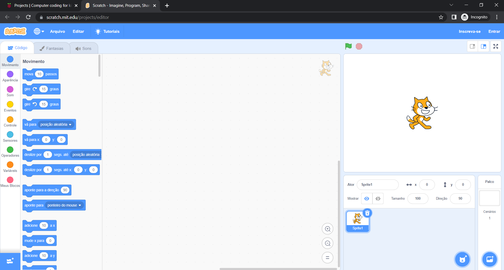
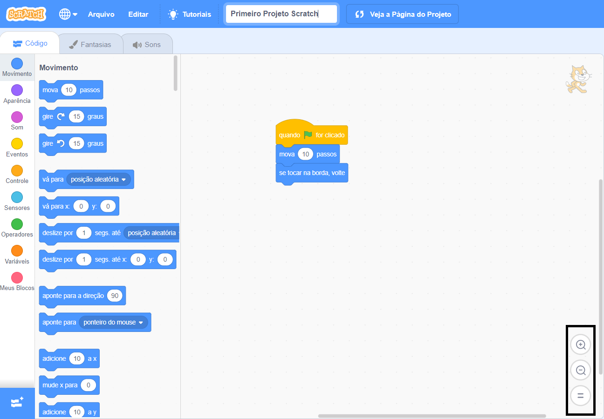

## Configurar o Scratch
Você pode usar o Scratch em um laptop ou computador, ou em um tablet. Você também pode usar o Scratch em um computador Raspberry Pi.

--- task ---

Abra um navegador da web em seu computador ou tablet e visite [rpf.io/scratch-new](https://rpf.io/scratch-new){:target="_blank"} para abrir um novo projeto no editor Scratch. O Scratch será aberto em uma nova aba no seu navegador da web.

**Dica:** Você também pode visitar [scratch.mit.edu](https://scratch.mit.edu/){:target="_blank"} e então clicar em **Criar**.

--- collapse ---
---
título: Trabalhar off-line sem conexão com a Internet
---

Se precisar trabalhar offline (sem uma conexão com a Internet), você pode [baixar o Scratch](https://scratch.mit.edu/download){:target="_blank"} e instalá-lo em um computador.

Você não pode trabalhar offline se estiver usando um tablet.

--- /collapse ---

--- collapse ---
---
título: Scratch em um Raspberry Pi
---

Se você estiver usando um computador Raspberry Pi, o Scratch pode já ter vindo instalado. Clique no ícone **Raspberry Pi** para abrir o menu, em seguida clique em **Programação**, e selecione **Scratch 3**.

Se você precisar instalar o Scratch, siga este processo:
+ Clique no ícone do Raspberry Pi para abrir o menu
+ Clique em **Preferências**
+ Clique em **Programas Recomendados**
+ Selecione **Scratch 3**
+ Clique em **OK**

Veja [Scratch 3 Desktop para Raspberry Pi](https://www.raspberrypi.org/blog/scratch-3-desktop-for-raspbian-on-raspberry-pi/) para obter mais informações.

--- /collapse ---

--- /task ---

--- task ---

Ao usar o Scratch com este guia ou um de nossos projetos, você precisará alternar entre o Scratch e as instruções do projeto.

--- collapse ---
---
título: Alternar entre as abas do navegador
---

Clique (ou toque, se estiver usando um tablet) no título de uma aba do navegador para alternar entre o editor Scratch e as instruções do projeto.

--- /collapse ---

--- collapse ---
---
título: Instruções lado a lado e Scratch
---

Se sua tela for grande o suficiente, você pode ver o Scratch ao lado das instruções do projeto.

Se você estiver usando o Windows 10, arraste a aba do Scratch do seu navegador para que fique em uma janela separada e continue arrastando até que o cursor alcance a borda direita da tela. A janela será então posicionada no lado direito da tela.

Agora, arraste a janela que contém este guia ou as instruções do projeto para o lado esquerdo da tela até que o cursor alcance a borda esquerda. A janela ocupará a metade esquerda da tela.

Você pode redimensionar as janelas para deixá-las do jeito que você quiser.

**Dica:** Você também pode manter a tecla <kbd>Windows</kbd> pressionada e apertar as setas <kbd>esquerda</kbd> ou <kbd>direita</kbd> para posicionar uma janela na metade esquerda ou direita da tela.

--- /collapse ---

Tente e veja como você prefere.

--- /task ---

--- task ---

Ao usar o Scratch em um navegador, você pode aumentar ou diminuir o zoom para ajustar o tamanho.

For example, if you are using Microsoft Windows and you want to use zoom on a webpage in Google Chrome or Microsoft Edge, hold down the <kbd>Ctrl</kbd> key and press the <kbd>+</kbd> key or <kbd>-</kbd> key to zoom in or out.

--- collapse ---
---
title: Use zoom in the Code area
---

You can also use the zoom controls in the Code area in Scratch to change the size of the code blocks in the Code area.

--- /collapse ---

--- /task ---

