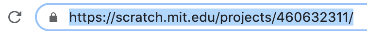

## Compartilhe e comente

--- task ---

Para permitir que outras pessoas acessem seu projeto, torne-o público. Você também pode compartilhar o endereço web exclusivo do seu projeto com outras pessoas.

[[[share-scratch]]]

--- collapse ---
---
title: Mais sobre como compartilhar o endereço da web do seu projeto
---

+ Seu projeto sempre começará na posição em que você o salvou pela última vez, então certifique-se de salvar seu projeto na posição inicial correta
+ Quando vocês clicar em **Ver Página do Projeto**, o endereço web do seu projeto aparecerá na barra de endereços do navegador: {:largura="400px"}
+ Copie o endereço web e cole-o em um e-mail ou anote o endereço para dá-lo à pessoa com quem você deseja compartilhar o projeto

**Dica:** Você pode acessar projetos completos do Scratch em um computador ou dispositivo móvel.

--- /collapse ---

--- collapse ---
---
title: O que inserir nas Instruções e Notas e Créditos
---

Na página do projeto, você pode preencher as instruções para explicar como usa-lo e colocar notas e créditos sobre seu projeto.

Na caixa **Instruções**, diga às pessoas como usar seu projeto:
+ Inclua todas as instruções para que o usuário entenda a explorar totalmente o seu projeto.
+ Certifique-se de que suas instruções são fornecidas passo a passo e são simples. As instruções são mais fáceis de ler se você as escrever em uma lista.
+ Inclua toda a interação do usuário, como clicar na bandeira verde para iniciar e em quais atores clicar.
+ Informe ao usuário se o projeto inclui som, pois pode ser necessário usar fones de ouvido ou aumentar o volume do dispositivo.

Na caixa **Notas e Créditos**:
+ Agradeça às pessoas que criaram os projetos que inspiraram você. Você pode até incluir os endereços web dos projetos.
+ Você incluiu imagens ou sons criados por outra pessoa? Em caso afirmativo, credite a(s) fonte(s) nesta caixa.

--- /collapse ---

--- /task ---

--- task ---

Dê e receba feedback em projetos.

[[[comments-feedback-scratch]]]

--- /task ---

