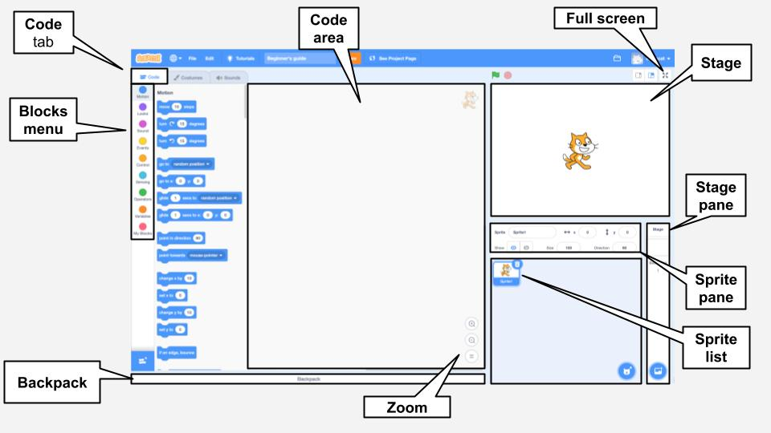

## O editor Scratch

O **Palco** é onde a ação ocorre em seu projeto. O Palco tem uma ou mais imagens de fundo chamadas **Cenários**.

Os **Atores** são personagens e objetos que aparecem no **Palco**. Os Atores recebem instruções usando blocos de código Scratch. Isso é chamado de **programação**.

Arraste os **blocos de código** da área de **blocos** para a área de **códigos** para programar seus atores e o Palco. Os blocos de código podem fazer um ator se mover, mudar de aparência e reproduzir sons.

Os atores podem ter várias **fantasias**. Você pode mudar a fantasia para mudar a aparência de um ator. Isso pode ser usado para efeitos como dar a impressão de estar andando.

Um **script** é uma série de blocos que são unidos para dar instruções ao Palco ou aos Atores. O Palco e os atores podem ter muitos scripts diferentes. 

