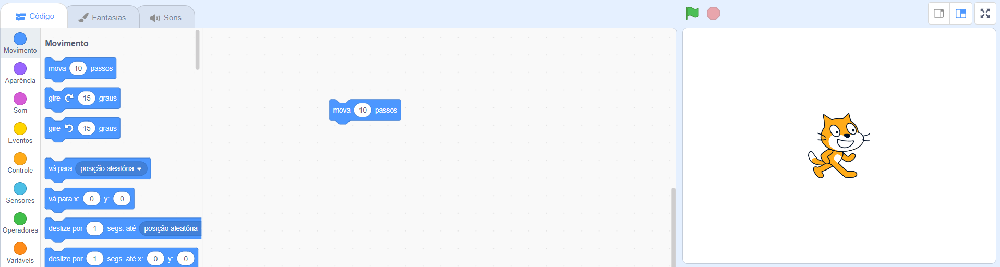
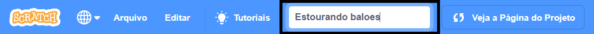

## Seu primeiro projeto Scratch


--- task ---

Quando você cria um novo projeto Scratch, ele inclui um **Gato** como ator.

Arraste os blocos do menu Blocos para a área Código para fazer o gato fazer alguma coisa.

Para tentar um exemplo, arraste a bloco `mova`{:class="block3motion"} da categoria `Movimento`{:class="block3motion"}. Os blocos são coloridos para ajudá-lo a encontrá-los.



Você pode clicar nos blocos na área de Código para executá-los. Clique no bloco `mova`{:class="block3motion"} e o gato se moverá.

**Dica:** Se estiver usando o Scratch em um tablet, você pode tocar em um item para clicar nele.

**Blocos Hat** executam o código abaixo deles quando um evento em particular acontece. O bloco `quando a bandeira verde for clicada`{:class="block3events"} executa o código quando você clica na bandeira verde acima do Palco.

Arraste um bloco `quando a bandeira verde for clicada` {:class="block3events"} acima do bloco `mova`para que eles se encaixem.


Seu código deve ficar assim:

```blocks3
when flag clicked
move (10) steps
```

**Dica:** Os blocos do Scratch são coloridos de acordo com a categoria, assim você vai encontrar o bloco `quando a bandeira verde for clicada`{:class="block3looks"} na categoria `Eventos`{:class="block3looks"}.

Agora, clique na bandeira verde acima do Palco e o gato vai se mover.

--- /task ---

Você pode adicionar mais atores ao seu projeto e também pode adicionar um cenário.

--- task ---

--- collapse ---
---
título: Escolha um ator
---

Na lista de Atores, clique em **Selecione um Ator** para ver a biblioteca com todos os atores do Scratch.


Você pode pesquisar por um stor ou navegar por uma categoria ou tema. Clique no ator para adicioná-lo ao seu projeto.


--- /collapse ---

--- /task ---

--- task ---

--- collapse ---
---
título: Escolha um cenário
---

No canto inferior direito no painel do Palco, clique em **Selecionar Cenário**.


Você pode pesquisar por um cenário ou navegar por categoria ou tema. Clique no cenário para adicioná-lo ao seu projeto.


--- /collapse ---

--- /task ---

--- task ---

--- collapse ---
---
título: Nomeie e salve seu projeto
---

Vá para **Arquivo** no menu. Se você tiver uma conta Scratch, clique em **Salvar agora**. Se você não possui uma conta, clique em **Salvar no seu computador**.

Click in the project name box and change the name to match your project.



If you share your project, then other people will also see this name, so make sure that it makes sense.

--- /collapse ---

--- /task ---

You have created your first Scratch project!

You are now ready to learn Scratch. We recommend that you start with our [Scratch: Module 1](https://projects.raspberrypi.org/en/raspberrypi/scratch-module-1){:target="_blank"} and/or [Look after yourself](https://projects.raspberrypi.org/en/raspberrypi/look-after-yourself){:target="_blank"} pathways, which are designed for beginners.

 You can return to this guide if you need help using Scratch when you are working on our pathway projects or on your own independent projects. 


