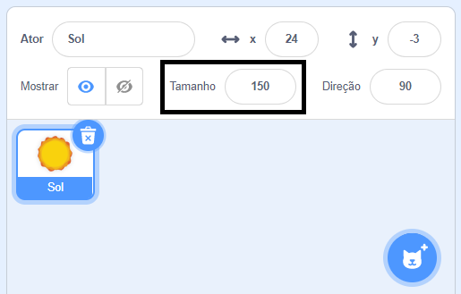

## Aparência

Blocos da categoria `Aparência`{:class="block3looks"} controlam a aparência de um ator no Palco.

Sprites podem se comunicar usando o menu `Aparências`{:class="block3looks"}, através de um balão de `fala`{:class="block3looks"}, um balão de `pensamento`{:class="block3looks"}, ou através dos `efeitos gráficos`{:class="block3looks"}.

### Falar e pensar

```blocks3
say () for () seconds

say ()

think () for () seconds

think ()
```

--- collapse ---
---
title: Use um balão de fala para se comunicar
---

Atores podem `falar`{:class="block3looks"} e `pensar`{:class="block3looks"} para se comunicar.

Os blocos `diga () por () segundos`{:class="block3looks"} e `pense () por () segundos`{:class="block3looks"} são usados para falar ou pensar em algo por uma certa quantidade de tempo.

```blocks3
when this sprite clicked
say [Olá!] for [2] seconds // esconde a fala após 2 segundos
```

A ator irá mostrar um balão de fala por 2 segundos quando for clicado.

**Conversa espacial**: [Ver interior](https://scratch.mit.edu/projects/1033302796/editor){:target="_blank"}

Clique nos atores para ver eles conversarem com falas e pensamentos.

<div class="scratch-preview">
  <iframe allowtransparency="true" width="485" height="402" src="https://scratch.mit.edu/projects/embed/1033302796/?autostart=false" frameborder="0"></iframe>
</div>

Os blocos `diga ()`{:class="block3looks"} e `pense ()`{:class="block3looks"} são usados para falar ou pensar algo, até que outra mensagem ou um bloco `diga ()`{:class="block3looks"} ou `pense ()`{:class="block3looks"} que estejam vazios substitua o primeiro.

--- /collapse ---

### Tamanho

Defina ou altere o `tamanho`{:class="block3looks"} de seus atores.

```blocks3
change size by ()

set size to () %

(size)
```

--- collapse ---
---
title: Defina o tamanho do seu ator
---

Quando você adiciona um ator ao seu projeto, o tamanho dele é definido como `100` por cento. Isso pode ser grande ou pequeno demais para o seu projeto.

Você pode usar código para redefinir o tamanho de um ator. Para fazer isso, use um bloco `defina o tamanho como`{:class="block3looks"}:

```blocks3
set size to (50) %
```

Se você definir tamanho de um ator para `50` por cento, ele ficará menor pela metade, tanto na altura como na largura. Se você definir o tamanho de um ator para `200` por cento, ele ficará duas vezes maior tanto na altura como na largura.

Para definir o tamanho de um ator quando o projeto é iniciado, coloque um bloco `defina o tamanho como`{:class="block3looks"} sob um bloco `quando a bandeira verde for clicada`{:class="block3events"}:

```blocks3
when green flag clicked
set size to (50) %
```

Você tambem pode definir rapidamente o tamanho de um ator pela propriedade **Tamanho** no painel do Ator abaixo do Palco:

{:width="400px"}

--- /collapse ---

### Efeitos gráficos

Defina ou altere uma gama de efeitos visuais, tais como cores, efeito olho-de-peixe, espiral, pixelado, mosaico, brilho e efeito fantasma.

```blocks3
change [cor v] effect by ()

set [cor v] effect to ()

clear graphic effects
```

[[[scratch3-graphic-effects]]]

### Fantasias

Para criar um efeito de animação em seus sprites, você pode alterar seus trajes.

```blocks3
switch costume to ( v)

next costume

(costume [número v])
```

[[[scratch3-change-costumes-to-show-mood]]]

--- collapse ---
---
title: Mude a aparência para criar um efeito de animação
---

**Coração batendo**: [Ver interior](https://scratch.mit.edu/projects/435725413/editor){:target="_blank"}

<div class="scratch-preview">
  <iframe allowtransparency="true" width="485" height="402" src="https://scratch.mit.edu/projects/embed/435725413/?autostart=false" frameborder="0"></iframe>
</div>

Você pode usar os blocos `defina o tamanho como`{:class="block3looks"} ou `mude o tamanho`{:class="block3looks"} para criar efeitos, tal como, de um coração batendo.

**Observação**: O bloco `defina o tamanho como`{:class="block3looks"}, define o tamanho de um ator para um valor específico, enquanto que o bloco `mude o tamanho`{:class="block3looks"}, altera o valor que estava anteriormente. Por exemplo, `mude o tamanho`{:class="block3looks"} para `10` adiciona 10 ao valor de tamanho anterior.

```blocks3
when green flag clicked
set size to (160) %
forever
change size by (40)
wait (0.2) seconds
change size by (20)
wait (0.2) seconds
change size by (-20)
wait (0.2) seconds
change size by (-40)
wait (0.2) seconds
end
```

Este código usa uma série de blocos `mude no tamanho`{:class="block3looks"} e `espere`{:class="block3control"} para fazer o coração crescer e depois diminuir. Tente criar o seu próprio ator animado.

Você poderia também usar o bloco `defina o efeito como`{:class="block3looks"} para criar um ator que continua a mudar sua aparência.

```blocks3
when green flag clicked
change [fantasma v] effect by (75)
wait (1) seconds
change [fantasma v] effect by (-75)
```

**Observação:** Se você usar código que altere um efeito gráfico e depois volte ao normal, lembre de usar blocos `espere`{:class="block3control"} entre os blocos `defina o efeito como`{:class="block3looks"}, senão isso vai acontecer tão rápido que você não vai conseguir ver!

Você pode usar um bloco `remova os efeitos gráficos`{:class="block3looks"} a qualquer momento para redefinir os efeitos:

```blocks3
clear graphic effects
```

--- /collapse ---

--- collapse ---
---
title: Clique para alterar e, em seguida, voltar ao normal
---

Você pode adicionar ações que alteram o ator e depois reverte-las. Ações como: aumentar, esperar e depois diminuir.

**A bola de squash quando clicada**: [Veja o exemplo](https://scratch.mit.edu/projects/435723273/editor){:target="_blank"}

<div class="scratch-preview">
  <iframe src="https://scratch.mit.edu/projects/435723273/embed" allowtransparency="true" width="485" height="402" frameborder="0" scrolling="no" allowfullscreen></iframe>
</div>

Este código vai aumentar um ator de tamanho, aplicar o efeito `olho de peixe`{:class="block3looks"} por 0,5 segundos, e em seguida, retornar o ator para sua aparência inicial:

```blocks3
when this sprite clicked
set size to (110)
set [olho de peixe v] effect to (50)
wait (0.5) seconds
set [olho de peixe v] effect to (0)
set size to (100)
```

--- /collapse ---

[[[scratch3-animate-movement-costumes]]]

### Cenários

Você pode usar código para alterar o cenário também.

```blocks3
switch backdrop to ( v)

next backdrop

(backdrop [número v])
```

[[[scratch3-changing-backdrops-pages-levels]]]

### Visibilidade

Os blocos `mostre`{:class="block3looks"} e `esconda`{:class="block3looks"} controlam a visibilidade de um ator.

```blocks3
show 

hide
```

[[[scratch3-show-hide-sprites-backdrops]]]

### Camadas

Para alterar como seus atores aparecem em relação uns aos outros, você pode usar camadas.

```blocks3
go to [da frente v] layer

go [frente v] () layers
```

[[[scratch3-positioning-with-layers]]]

--- collapse ---
---
title: Posicione atores em muitas camadas
---

**Através da janela com árvore**:[Ver interior](https://scratch.mit.edu/projects/454188775/editor){:target="_blank"}

<div class="scratch-preview">
  <iframe allowtransparency="true" width="485" height="402" src="https://scratch.mit.edu/projects/embed/454188775/?autostart=false" frameborder="0"></iframe>
</div>

No exemplo, o ator **moldura de janela** aparece na frente e o ator**Sol** aparece atrás. Os atores **Avery Caminhando** e **Árvore** estão cada um em suas próprias camadas, entre o ator **Moldura de janela** e o ator **Sol**.

Use o bloco de `vá para trás`{:class="block3looks"} `1` `camadas`{:class="block3looks"} para colocar o ator uma camada atrás do ator da frente:

``` blocks3
when green flag clicked
go to [da frente v] layer
+go [trás v] (1) layers
```

Altere o valor do bloco `vá para trás`{:class="block3looks"} `1``camadas`{:class="block3looks"} para cada ator, dependendo de onde você quer que ele seja posicionado em relação aos outros atores:

``` blocks3
when green flag clicked
go to [da frente v] layer
+go [trás v] (2) layers
```

--- /collapse ---

