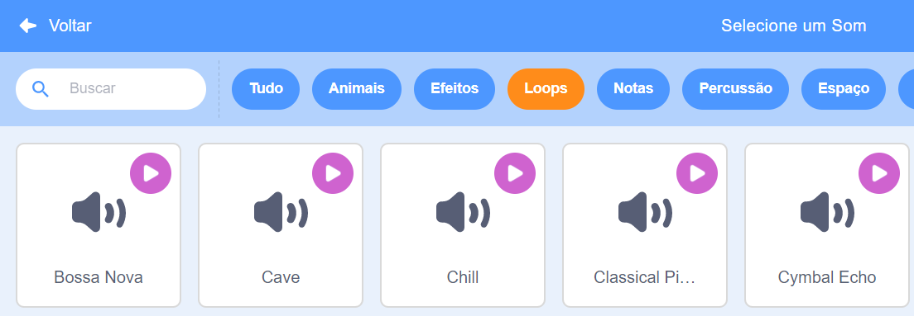

## Som

Para adicionar som ao seu projeto, use blocos da categoria` Som`{: class = "block3sound"}. Por exemplo, você pode criar uma trilha sonora de fundo contínua ou adicionar sons que serão reproduzidos em intervalos regulares.

{:width="600px"}

Primeiro, escolha um som da Biblioteca de sons ou grave seu próprio som.

[[[scratch3-add-sound]]]

[[[scratch3-record-sound]]]

Adicione código para executar blocos de `Som`{:class="block3sound"} no lugar que você deseja que exista som em seu projeto.

--- collapse ---
---
title: Adicione um som de longa duração para criar uma trilha sonora contínua
---

Clique na bandeira verde para ouvir os sons.

**Trilha de rádio**: [Ver interior](https://scratch.mit.edu/projects/444581851/editor){:target="_blank"}

<div class="scratch-preview">
 <iframe allowtransparency="true" width="485" height="402" src="https://scratch.mit.edu/projects/embed/444581851/?autostart=false" frameborder="0"></iframe>
</div>

Você pode usar o bloco `toque o som até o fim`{:class="block3looks"} dentro de um loop `sempre`{:class="block3control"}. Assim que o som terminar, o loop `sempre`{: class = "block3control"} faz com que o som comece novamente do início.

Este código usa um único clipe de som longo, repetido ao longo do código como trilha sonora:

```blocks3
when green flag clicked
forever
play sound (Dance Snare Beat v) until done
end
```

**Nota:** Ao escolher um novo som, se você selecionar a categoria **Loops**, o Scratch só mostrará os sons adequados para uma única trilha sonora repetida ao longo da execução do código.



--- /collapse ---

--- collapse ---
---
title: Adicione uma sequência de sons curtos para criar uma trilha sonora contínua
---

Clique na bandeira verde para ouvir o som.

**Performance campeã**: [Ver interior](https://scratch.mit.edu/projects/444673165/editor){: target = "_ blank"}

<div class="scratch-preview">
 <iframe allowtransparency="true" width="485" height="402" src="https://scratch.mit.edu/projects/embed/444673165/?autostart=false" frameborder="0"></iframe>
</div>

 Use um bloco `sempre`{:class="block3control"} para repetir um som em loop. Você pode:
+ Colocar uma série de sons curtos em uma sequência, ou
+ Usar diferentes notas e efeitos de instrumento

```blocks3
when flag clicked
forever
play sound (Low Boing v) until done
play sound (Low Boing v) until done
play sound (Drum Buzz v) until done
play sound (Pop v) until done
play sound (Bird v) until done
play sound (Bark v) until done
play sound (Glug v) until done
End
```

--- /collapse ---

--- collapse ---
---
title: Adicione sons que serão reproduzidos em intervalos regulares
---

**Sons de futebol**: [Ver interior](https://scratch.mit.edu/projects/450870079/editor){: target = "_ blank"}

Clique na bandeira verde para ouvir o som.

<div class="scratch-preview">
 <iframe allowtransparency="true" width="485" height="402" src="https://scratch.mit.edu/projects/embed/450870079/?autostart=false" frameborder="0"></iframe>
</div>

 Neste projeto, o **Palco** usa código para reproduzir um som em intervalos regulares:

 ```blocks3
 when flag clicked
 forever
 wait (3) seconds
 play sound (Cheer v) until done
 end
 ```

O ator **Apito** também toca um som em intervalos regulares:

 ```blocks3
 when this sprite clicked
 forever
 play sound (Referee Whistle v) until done
 wait (4) seconds
 end
 ```

--- /collapse ---

--- collapse ---
---
title: Adicionar sons que começam a tocar ao mesmo tempo
---

Existem dois blocos de `Som`{:class="block3sound"} com uma importante diferença:

+ Quando você utilizar `toque o som até o fim`{: class = "block3sound"}, o som será reproduzido até o fim. A próxima linha de código no script não será executada até que o som termine de tocar.

+ Quando você utilizar `toque o som`{: class="block3sound"}, o som será reproduzido, mas o próximo bloco será executado imediatamente e não vai esperar que o som seja reproduzido primeiro.

Isso significa que se você tivesse uma série de blocos `toque o som`{:class="block3sound"}, os sons seriam todos reproduzidos quase ao mesmo tempo, um após o outro. O efeito pode ser interessante e às vezes confuso.

Divirta-se com isso quando tiver tempo!

```blocks3
when green flag clicked
start sound (Meow v)
start sound (Alien Creak2 v)
start sound (Boing v)
start sound (Boom Cloud v)
start sound (Baa v)
```

--- /collapse ---

Depois de escolher seus sons, você pode alterar o `volume`{: class="block3sound"}, `tom`{:class="block3sound"} ou alterar o `balanço esquerda/direita`{:class="block3sound"} ( para ouvir o som do alto-falante esquerdo ou direito).

--- collapse ---
---
title: Volume, tom e balanço esquerda/direita
---

Clique na bandeira verde para ouvir o som.

**Treino de banda**: [Ver interior](https://scratch.mit.edu/projects/451697380/editor){: target="_ blank"}

<div class="scratch-preview">
 <iframe allowtransparency="true" width="485" height="402" src="https://scratch.mit.edu/projects/embed/451697380/?autostart=false" frameborder="0"></iframe>
</div>

O ator **Tambor** utiliza os blocos `mude o volume para`{:class="block3sound"}, `mude o efeito tom`{:class="block3sound"} e `mude o efeito balanço esquerda/direita `{:class=" block3sound "} para alterar o som:

```blocks3
set volume to (80) %
set [pitch v] effect to (50) :: sound
set [pan left/right v] effect to (-100) :: sound
play sound (Drum Funky v) until done
```

+ Você pode `mudar o volume para`{: class = "block3sound"} um valor de `0` (silencioso) a `100` (volume total). Isso é útil se você quiser que alguns sons soem mais alto do que outros, ou se quiser que um ator apareça mais longe.

+ O efeito `tom`{: class = "block3sound"} controla o quão agudo ou grave é um som. Definir o tom para um valor mais alto também torna o som mais rápido. Você pode `mude o efeito tom para`{: classe = "block3sound"} valores entre `-360` (muito baixo) e `360` (muito alto).

+ O efeito `balanço esqueda/direita`{: class = "block3sound"} permite que você controle se um som sai de um alto-falante esquerdo ou direito, ou de um fone de ouvido, ou de ambos. Você pode `mudar o efeito balanço esquerda/direita para`{: class = "block3sound"} valores de `-100` (todo o som a partir da esquerda) para `100` (todo o som a partir da direita).

--- /collapse ---

Você também pode usar a extensão `Texto para Fala`{:class="block3extensions"}:

[[[scratch3-text-to-speech]]]

