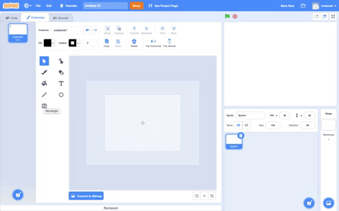
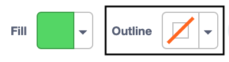

## Редактор Малювання

Використовуй редактор Малювання для створення власного тла та образів, а також для редагування вже наявних образів і тла.

{:width="600px"}

[[[scratch3-paint-a-new-backdrop-extended]]]

[[[scratch3-backdrops-and-sprites-using-shapes]]]

[[[scratch3-use-text-tool]]]

[[[scratch3-add-costumes-to-a-sprite]]]

[[[scratch-crosshair]]]

[[[scratch3-copy-parts-between-sprite-costumes]]]

--- collapse ---
---
title: Копіювання та редагування образа для використання в анімації
---

Деякі спрайти Scratch мають лише один образ або декілька образів, які не працюють як анімація. Якщо ти вибереш один образ, продублюєш його (зробиш його копію) та внесеш невеликі зміни - це може створити ефект анімації.

**Анімація робота**: [Переглянути код](https://scratch.mit.edu/projects/436260207/editor){:target="_blank"}

  <iframe allowtransparency="true" width="485" height="402" src="https://scratch.mit.edu/projects/embed/436260207/?autostart=false" frameborder="0"></iframe>

Перейди на вкладку **Образи** для твого спрайта.

Вибери образ, який хочеш використати, а інші видали, тому що вони не потрібні для твоєї анімації. Наприклад, спрайт **Robot** містить образи для трьох різних роботів, тому тобі потрібно вибрати один з образів, а інші видалити.

Клацни правою кнопкою миші (або на планшеті торкнись і утримуй) по образу та вибери **дублювати**.

Внеси невеликі зміни в копію образа. Наприклад, ти можеш переміщати, обертати, змінювати весь костюм або його частину. Також ти можеш додавати лінії руху.

Якщо у твоєму образі використовується векторна графіка, ти можеш виділяти частини костюма і змінювати кожну частину окремо.

Ти можеш продублювати костюм ще раз і внести більше змін, щоб додати більше кадрів до твоєї анімації.

Тепер ти можеш використовувати свої образи в простій анімації зі спрайтів.

--- /collapse ---

--- collapse ---
---
title: Використання інструменту Заповнення для зміни кольорів у образі
---

Ти можеш змінювати колір свого спрайта. Спочатку вибери свій спрайт у списку Спрайт під Сценою, а потім перейди на вкладку **Образи**.

Використовуй інструмент **Обрати** (Стрілочка), щоб вибрати частину костюма, колір якої ти хочеш змінити.

{:width="200px"}

{:width="300px"}

Клацни на інструмент вибору кольору **Заповнення** та вибери колір. Це автоматично заповнить обрану тобою форму.

{:width="300px"}

Повтори наведені вище кроки для будь-якої частини образу, яку ти пропустив, або для будь-якої іншої частини образу, колір якої ти хочеш змінити.

{:width="300px"}

{:width="300px"}

{:width="300px"}

--- /collapse ---

Скористайся наведеними нижче порадами, які допоможуть тобі створювати власні дизайни для своїх спрайтів у редакторі Малювання.

--- collapse ---
---
title: Створення пейзажів за допомогою спрайтів
---

**Пагорб у вигляді спрайта**: [Переглянути код](https://scratch.mit.edu/projects/452582516/editor){:target="_blank"}

{:width="400px"}

Щоб зробити свій власний спрайт**пагорба**, який зображений на прикладі вище, ти можеш скористатися інструментами **Коло** та **Прямокутник** у редакторі Малювання:

+ Клацни на кнопку **Обрати спрайт** та вибери **Малювати**, щоб створити новий образ для спрайта.

{:width="400px"}

+ Вибери колір для **Заповнення**. Клацни на **Межа** та зніми позначку (для цього необхідно натиснути на поле з діагональною лінією в лівому нижньому кутку меню). Тепер, використовуй інструмент **Коло**, щоб намалювати овал. Далі, вибери інструмент **Прямокутник** та намалюй прямокутник під овалом.

+ Якщо ти використовуєш різні кольори для фігур, тобі можуть знадобитися інструменти **Попереду** та **Позаду** в редакторі Малювання, щоб переміщати фігури вперед або назад так, щоб вони правильно стояли на тлі.

+ Ти можеш виділити всі фігури та **Групувати** їх разом, щоб можна було редагувати або переміщувати їх як одну фігуру.

{:width="400px"}

Тепер створи інші спрайти для декорації, якщо це відповідає ідеї твого проєкту.

Не забувай давати назви своїм спрайтам.

--- /collapse ---

--- collapse ---
---
title: Використання інструменту Лінія для створення трикутника
---

Ти можеш створювати багатокутники, наприклад, трикутник, і використовувати ці фігури для створення дахів або гір.

Клацни на кнопку **Обрати спрайт** та вибери **Малювати**, щоб створити новий образ для спрайта. В даному прикладі ти будеш робити будинки.

**Будинок**: [Переглянути код](https://scratch.mit.edu/projects/453595663/editor){:target="_blank"}

{:width="400px"}

Якщо ти будеш дотримуватися наведених нижче інструкцій, то зможеш за допомогою інструмента **Лінія** створити будь-яку фігуру:
+ Вибери колір для **Заповнення**. Щоб вибрати чорний колір, зменшуй значення **Яскравість** до нуля (`0`).

{:width="150px"}

+ Вибери **Без межі**.

{:width="200x"}

+ Використовуй інструмент **Прямокутник**, щоб намалювати прямокутник.
+ Використовуй інструмент **Лінія**, щоб намалювати трикутник. Переконайся, що ти повністю завершив трикутник, інакше він не заповниться кольором.
+ Перемісти обидві фігури разом.
+ Вибери інструмент **Заповнення** (Відро) та заповни трикутник кольором.
+ Використовуй інструмент **Прямокутник**, щоб намалювати ще один прямокутник для димоходу.
+ Ти можеш скористатися інструментом **Попереду** та **Позаду** в редакторі Малювання, щоб переміщати фігури вперед або назад так, щоб вони були правильно розташовані. У цьому прикладі тобі не потрібно це робити, тому що фігури замальовані чорним кольором, щоб створити ефект силуету.
+ Виділи всі фігури та натисни **Групувати**, щоб їх можна було регулювати або переміщати як одну фігуру.

Щоб створити дублікати фігур будинку (наприклад, для створення лінії горизонту), дотримуйся порад у розділі **Дублювання фігур для створення пейзажу** нижче.

--- /collapse ---

--- collapse ---
---
title: Дублювання фігур для створення пейзажу
---

Можливо, ти захочеш продублювати фігури в образі, щоб твій пейзаж виглядав більш насиченим або наповненим.

**Декілька хмар**: [Переглянути код](https://scratch.mit.edu/projects/447278432/editor){:target="_blank"}

{:width="400px"}

Ефект множення фігур використовується професійними аніматорами, щоб створювати ефект погодних явищ, таких як дощ або хмари; скупчення об'єктів, таких як будівлі або ліс; або натовп на сцені.

--- no-print ---

--- /no-print ---

Для розмноження фігур будь-якого типу:
+ Натисни на **Обрати спрайт** та вибери, для цього прикладу, спрайт **Cloud**
+ На вкладці **Образи**, використовуй інструмент **Обрати**, щоб виділити всі елементи фігури
+ Використовуй інструменти **Копія** та **Вставити**, щоб створити дублікати фігури
+ Використовуй інструмент**Обрати**, щоб переміщувати фігуру в межах редактора Малювання
+ Наприклад, ти можеш змінювати розмір фігур для створення 3D ефекту
+ Ти можеш вибрати всі фігури та **Групувати** їх разом, щоб можна було регулювати або переміщати їх як одну фігуру

--- /collapse ---

--- collapse ---
---
title: Використання насиченості та яскравості для створення ефекту глибини
---

У реальному світі об'єкти, які знаходяться далі, здаються світлішими за кольором. Для досягнення більш реалістичних 3D пейзажів, ти можеш **зменшити** **Насиченість** та/або **Яскравість** кольорів кожного спрайта так, щоб здавалось, що вони віддалялися все далі й далі.

{:width="400px"}

--- /collapse ---

--- collapse ---
---
title: Створення спрайта з проміжками, через які можна бачити
---

Ти можеш створити спрайт, який має проміжки, через які ти можеш бачити. Якщо він розташований на передньому плані та має розмір Сцени, виникає враження, що це вид крізь ґрати клітки або вікна.

--- no-print ---

**Лев у клітці**: [Переглянути код](https://scratch.mit.edu/projects/445680159/editor){:target="_blank"}

--- /no-print ---

Створення типу маскувального спрайта:
+ Натисни на **Обрати спрайт** та вибери **Малювати**
+ Вибери колір **Заповнення** без **Межі** та намалюй вертикальний прямокутник
+ Використовуй інструменти **Копія** та **Вставити**, щоб повторювати цю фігуру
+ Використовуй інструмент **Обрати**, щоб переміщати фігури
+ Розміщуючи фігури, переконайся, що вони торкаються краю Сцени, щоб відповідати твоїй ідеї проєкту

--- /collapse ---

**Порада:** Якщо тобі важко керувати спрайтами на сцені, наприклад, коли великий спрайт закриває собою менший, ти можеш натиснути на **Приховати**, щоб не бачити спрайт або декілька спрайтів. Далі, коли ти завершиш, натисни на **Показати** ще раз.

{:width="300px"}
