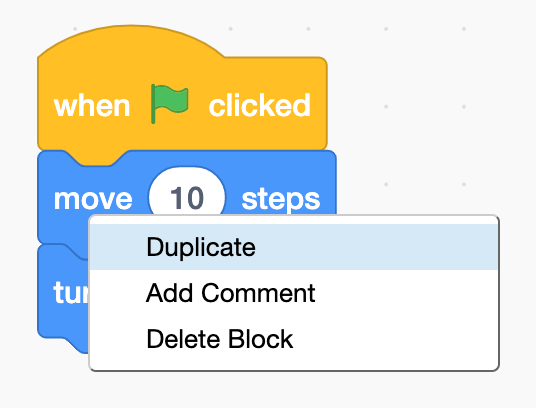
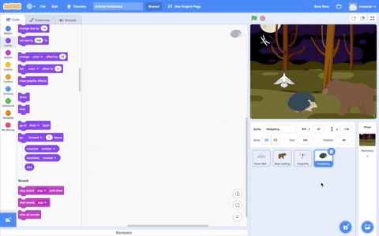

## Поради щодо редагування
Корисно навчитися копіювати та видаляти блоки коду, та дублювати спрайти.

**Порада:** Ти можеш використовувати <kbd>Ctrl-z</kbd> (утримуй клавішу Ctrl та натисни клавішу Z), щоб скасувати дії у Scratch. Якщо ти випадково видалив спрайт або інший елемент, ти можеш скористатися кнопкою **Скасувати** з меню **Редагування**, щоб повернути його назад.

Ти можеш видаляти блоки коду, які тобі більше не потрібні:

[[[scratch-delete]]]

Дублювання або копіювання коду може заощадити твій час при розробці проєкту.

--- collapse ---
---
title: Дублювання блоків
---

Дублюй блоки або набори блоків для повторного використання у програмі спрайта:

* Перейди до вкладки **Код**.
* Клацни правою кнопкою миші (або на планшеті торкнись і утримуй) по першому блоку, який потрібно скопіювати. Це також виділить всі блоки, що знаходяться під цим блоком.
* У спливаючому меню вибери **Дублювати**. {:width="300px"}
* Перетягни скопійований код в потрібне тобі місце. {:width="300px"}
* Видаляй всі блоки, які тобі більше не потрібні.

--- /collapse ---

[[[scratch3-duplicate-sprite]]]

Створи новий спрайт і скопіюй повністю або частково код першого спрайта.

--- collapse ---
---
title: Копіювання коду спрайта
---

У правому нижньому куті списку спрайтів натисни на **Обрати спрайт** та вибери спрайт, який ти хочеш додати.

Клацни на перший спрайт та перейди на вкладку **Код**. Перетягни код, який знаходиться в Області коду першого спрайта, на зображення другого спрайта в списку Спрайт, а потім відпусти код, щоб завершити його копіювання на другий спрайт. У тебе може бути один скрипт, який запускається блоком `коли зелений прапорець натиснуто`{:class="block3events"}, а також інший скрипт, який запускається за допомогою блоку `коли спрайт натиснуто`{:class="block3events"}. Переконайся, що ти скопіював **всі** коди скриптів, які ти створив.

{:width="300px"}

Тепер твій другий спрайт буде мати такий самий код, як і твій перший спрайт. Не запускай програму, поки не почнеш змінювати код другого спрайту — ти можеш не побачити другий спрайт, тому що він може бути розташований під першим спрайтом.

--- /collapse ---

Якщо ти хочеш копіювати образи, спрайти, звуки та скрипти між проєктами, перетягуй їх до вкладки **Сховок**.

[[[scratch-backpack]]]

Варто завжди приділяти час тому, щоб переконатися, що ти дотримуєшся найкращих практик та рекомендацій, щоб твій проєкт був легким для розуміння.

--- collapse ---
---
title: Найкращі практики для проєктів Scratch
---

- Називай розсудливо всі спрайти, образи, звуки, змінні та повідомлення. Набагато легше зрозуміти проєкти, які використовують зрозумілі назви.
- Заповни Сторінку проєкту гарним заголовком, інструкціями та примітками, щоб інші користувачі знали, як користуватися проєктом і звідки ти взяв ідеї.
- Додай короткі коментарі, які пояснюють, що робить твій код.
- Переконайся, що твої скрипти охайно виглядають на вкладці **Код**. Ти можеш клацнути правою кнопкою миші та вибрати **Впорядкувати блоки** або розташувати скрипти так, як тобі зручно. Спробуй поєднати схожі скрипти разом.

--- /collapse ---
