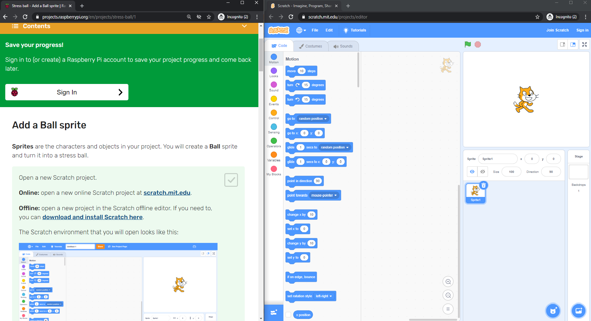

## Налаштуй Scratch
Ти можеш використовувати Scratch на ноутбуці або персональному комп'ютері, а також на планшеті. Також можна використовувати Scratch на комп'ютері Raspberry Pi.

--- task ---

Відкрий браузер на комп'ютері або планшеті та зайди на сайт [rpf.io/scratch-new](https://rpf.io/scratch-new){:target="_blank"}, щоб відкрити новий проєкт у редакторі Scratch. Scratch відкриється у новій вкладці твого браузера.

**Порада:** Також ти можеш зайти на сайт [scratch.mit.edu](https://scratch.mit.edu/){:target="_blank"} та натиснути на кнопку **Створити**.

--- collapse ---
---
title: Використання Scratch офлайн, без підключення до інтернету
---

Якщо ти хочеш використовувати Scratch в режимі офлайн (без підключення до інтернету), перейди на сайт [download Scratch](https://scratch.mit.edu/download){:target="_blank"} та встановити його на комп'ютер.

Ти не можеш використовувати планшет для роботи в офлайн-режимі.

--- /collapse ---

--- collapse ---
---
title: Scratch на Raspberry Pi
---

Якщо ти використовуєш комп'ютер Raspberry Pi, Scratch можливо уже встановлений. Клацни на іконку **Raspberry Pi**, щоб відкрити меню, далі натисни **Програмування**, потім вибери **Scratch 3**.

Якщо тобі необхідно встановити Scratch, скористайся цією інструкцією:
+ Клацни на іконку Raspberry Pi, щоб відкрити меню
+ Клацни на **Уподобання**
+ Натисни на **Рекомендоване програмне забезпечення**
+ Вибери **Scratch 3**
+ Клацни **Добре**

Подивись [Scratch 3 Desktop для Raspberry Pi](https://www.raspberrypi.org/blog/scratch-3-desktop-for-raspbian-on-raspberry-pi/) для більш детальної інформації.

--- /collapse ---

--- /task ---

--- task ---

Коли ти використовуєш Scratch з цим керівництвом або одним з наших проєктів, тобі потрібно буде перемикатися між Scratch та інструкціями до проєкту.

--- collapse ---
---
title: Перехід між вкладками браузера
---

Клацни (або на планшеті торкнись) назви вкладки браузера, щоб переключитися між редактором Scratch та інструкціями до проєкту.

--- /collapse ---

--- collapse ---
---
title: Інструкція пліч-о-пліч та Scratch
---

Якщо твій екран достатньо великий, ти можеш відкрити Scratch поруч з інструкціями до проєкту.

Якщо ти використовуєш Microsoft Windows 10, перетягни вкладку Scratch у браузері так, щоб вона опинилась в окремому вікні, і продовжуй перетягувати, поки курсор не дійде до правого краю екрана. Після цього вікно буде розташовано в правій частині екрана.

Тепер перетягни вікно, що містить це керівництво або інструкцію, в ліву частину екрана, поки курсор не дійде до лівого краю екрана. Після цього вікно буде розташовано в лівій частині екрана.

Ти можеш змінювати розмір вікон, щоб вони були такими, як ти хочеш.

**Порада:** Ти також можеш натиснути та утримувати клавішу <kbd>Windows</kbd> та натиснути клавішу зі стрілкою <kbd>Ліворуч</kbd> або клавішу зі стрілкою <kbd>Праворуч</kbd>, щоб розташувати вікно в лівій або правій половині екрана.

--- /collapse ---

Спробуй зараз і побачиш, як тобі буде зручніше працювати.

--- /task ---

--- task ---

Коли ти використовуєш Scratch у браузері, ти можеш збільшувати або зменшувати масштаб.

Наприклад, якщо ти використовуєш Microsoft Windows і хочеш скористатися масштабуванням на сторінці в Google Chrome або Microsoft Edge, утримуй клавішу <kbd>Ctrl</kbd> та натисни на клавішу <kbd>+</kbd> або <kbd>-</kbd>, щоб збільшити або зменшити масштаб.

--- collapse ---
---
title: Використання масштабування в Області коду
---

Ти також можеш використовувати елементи керування масштабуванням, які розташовані в Області коду в Scratch, щоб регулювати масштабування.

--- /collapse ---

--- /task ---

