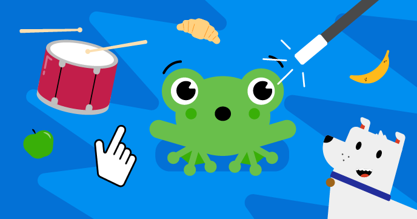

## Наші проєкти Scratch

Наші навчальні програми Scratch мають по шість проєктів, які допоможуть тобі освоїти різні навички роботи зі Scratch, щоб самостійно створювати свої власні проєкти.

Ти можеш повернутися до цього керівництва, Початок роботи у Scratch, щоразу, коли тобі потрібно буде пригадати вивчені навички.

Ці проєкти можна запустити на будь-якому комп'ютері або планшеті, який підтримує Scratch 3.

### Проєкти Scratch для новачків

Якщо ти новачок у Scratch, почни з наших навчальних курсів для початківців:

[Знайомство зі Scratch: спрайти, скрипти та цикли](https://projects.raspberrypi.org/en/pathways/scratch-intro){:target="_blank"} 
У цьому керівництві для початківців ти дізнаєшся, як додавати код, образи та звуки до спрайтів та створювати анімації, ігри, програми та історії.

[Піклуйся про себе](https://projects.raspberrypi.org/en/pathways/look-after-yourself){:target="_blank"} 
Навчись піклуватися про себе та інших за допомогою проєктів Scratch, які допоможуть тобі розважитися, розслабитися, навчитися володіти собою, творити, займатися спортом та зосереджуватися.

[Модуль Scratch 1](https://projects.raspberrypi.org/en/pathways/scratch-module-1){:target="_blank"}

 

### За межами основ проєктів Scratch

Якщо ти вже знаєш про спрайти, образи, тло та цикли, спробуй ці проєкти:

[Більше про Scratch: трансляція, рішення та змінні](https://projects.raspberrypi.org/en/pathways/more-scratch){:target="_blank"} 
Більше про Scratch виходить за межі основ, представлених у Знайомство зі Scratch. Ти будеш створювати програми, ігри та симулятори, використовуючи трансляцію повідомлень, рішення якщо...то та якщо...то...інакше, а також змінні.

[Модуль Scratch 2](https://projects.raspberrypi.org/en/pathways/scratch-module-2){:target="_blank"} 

 

### Просунуті проєкти Scratch

Якщо ти хочеш дізнатися про списки, клони та створення власних блоків, спробуй ці проєкти:

[Продовження Scratch: клони, мої блоки та булева логіка](https://projects.raspberrypi.org/en/pathways/further-scratch){:target="_blank"} 
Продовження Scratch виходить за рамки навичок, представлених у Знайомство зі Scratch та Більше про Scratch. Ти будеш створювати додатки, ігри, комп'ютерне мистецтво та симулятори, використовуючи булеву логіку, функції, клони та багато іншого.

[Захистимо нашу планету](https://projects.raspberrypi.org/en/pathways/protect-our-planet){:target="_blank"} 
Використовуй Scratch, щоб дізнатися про нашу планету та про те, як зберегти навколишнє середовище для майбутніх поколінь.

[Scratch для соціального підприємництва](https://projects.raspberrypi.org/en/coderdojo/scratch-for-social-enterprise){:target="_blank"} 

[Модуль Scratch 3](https://projects.raspberrypi.org/en/pathways/scratch-module-3){:target="_blank"} 

 

### Scratch GPIO обладнання для проєктів Raspberry Pi

Якщо у тебе є комп'ютер Raspberry Pi, ти також можеш спробувати ці проєкти. Тобі знадобляться додаткові електронні пристрої.

 

[Фізичні обчислення за принципом Scratch](https://projects.raspberrypi.org/en/pathways/physical-computing-with-scratch-and-the-raspberry-pi){:target="_blank"}

 

[Фізичні обчислення з додатковими проєктами Scratch](https://projects.raspberrypi.org/en/projects?software%5B%5D=scratch&hardware%5B%5D=raspberry-pi){:target="_blank"}

 

Чи сподобався тобі це керівництво по Scratch? Була виявлена помилка? Будь ласка, натисни кнопку **Надіслати відгук** нижче та розкажи нам про це!
