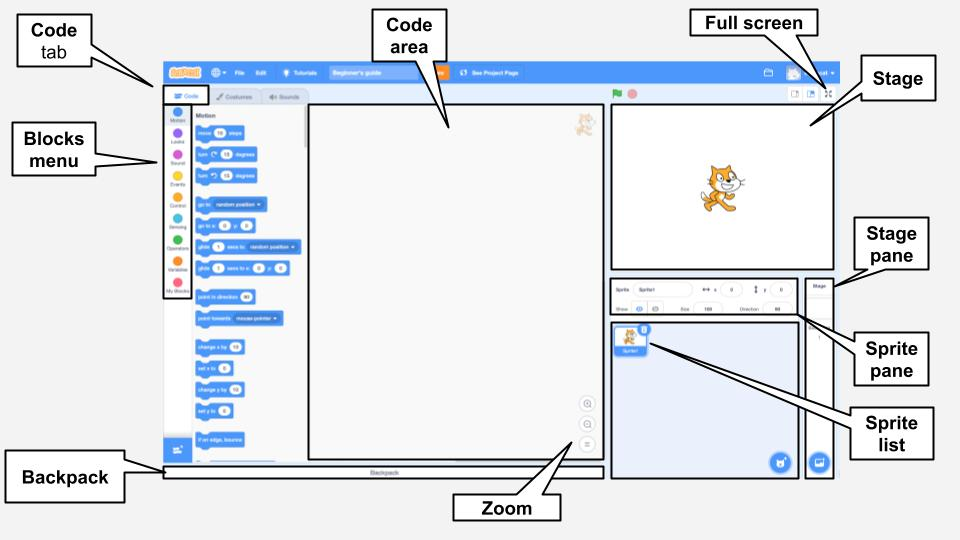

## Редактор Scratch

**Сцена** - це місце, де відбуваються дії у твоєму проєкті. На Сцені знаходиться одне або декілька фонових зображень, які називаються - **тло**.

**Спрайти** - це персонажі та об'єкти, які з'являються на **Сцені**. Спрайтам надаються інструкції за допомогою блоків коду Scratch. Це називається **програмування**.

Перетягни **блок коду** з **Меню блоків** в **Область коду**, щоб програмувати свої спрайти та Сцену. Блоки коду можуть змусити спрайт рухатися, змінювати зовнішній вигляд і відтворювати звуки.

Спрайти можуть мати декілька **образів**. Ти можеш змінювати образи, щоб змінити зовнішній вигляд спрайта. Це може бути використано для таких ефектів, як створення ефекту ходьби.

**Скрипт** - це серія блоків, які з'єднуються між собою та дають вказівки Сцені або спрайтам. Сцена та спрайти можуть мати багато різних скриптів. 

