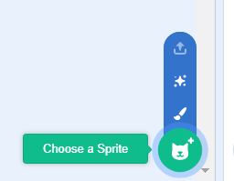
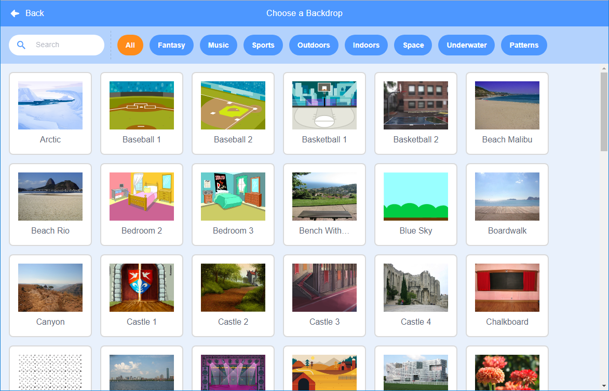

## Твій перший проєкт у Scratch


--- task ---

Коли ти створюєш новий проєкт у Scratch, він містить спрайт - **кіт**.

Перетягуй блоки з меню Блоки в Область коду, щоб змусити кота щось зробити.

Щоб спробувати приклад, перетягни блок `перемістити на`{:class="block3motion"} із меню блоків `Рух`{:class="block3motion"}. Блоки мають колір, який полегшує їх знаходження.


Ти можеш натиснути на блоки в Області коду, щоб запустити їх. Клацни на блок `перемістити на`{:class="block3motion"} і кіт буде рухатися.

**Порада:** Якщо ти використовуєш Scratch на планшеті, торкнись елемента, щоб вибрати його.

**Блоки з шапкою** запускають блоки під ними, коли відбувається певна подія. Блок `коли зелений прапорець натиснуто`{:class="block3events"} запускає код, коли ти натискаєш на зелений прапорець над Сценою, щоб запустити проєкт.

Перетягни блок `коли зелений прапорець натиснуто`{:class="block3events"} та розмісти його над блоком `перемістити на`{:class="block3motion"} так, щоб вони з'єдналися.


Твій код повинен виглядати так:

```blocks3
when flag clicked
move (10) steps
```

**Порада:** Блоки Scratch мають кольорове позначення, тому ти легко знайдеш блок `коли зелений прапорець натиснуто`{:class="block3events"} в меню блоків `Події`{:class="block3events"}.

Тепер клацни на зелений прапорець над Сценою, і кіт почне рухатися.

--- /task ---

Ти можеш додати більше спрайтів до свого проєкту, а також можеш додати тло.

--- task ---

--- collapse ---
---
title: Обираємо спрайт
---

У Списку спрайтів клацни на **Обрати спрайт**, щоб переглянути бібліотеку всіх спрайтів Scratch.



Ти можеш виконати пошук спрайта або знайти його за категорією чи темою. Натисни на спрайт, щоб додати його до свого проєкту.


--- /collapse ---

--- /task ---

--- task ---

--- collapse ---
---
title: Обираємо тло
---

У правому нижньому куті панелі Сцена, клацни на **Обрати тло**.


Ти можеш виконати пошук тла або знайти його за категорією чи темою. Клацни на тло, щоб додати його до свого проєкту.



--- /collapse ---

--- /task ---

--- task ---

--- collapse ---
---
title: Назви та збережи свій проєкт
---

Натисни на **Файл** в меню. Якщо у тебе є обліковий запис Scratch, натисни на **Зберегти негайно**. Якщо у тебе немає облікового запису, натисни на **Вивантажити на ваш комп'ютер**.

Клацни на поле назви проєкту та зміни назву, щоб вона відповідала твоєму проєкту.


Якщо ти поділишся своїм проєктом, інші люди також побачать цю назву, тому переконайся, що вона має певний сенс.

--- /collapse ---

--- /task ---

Ти створив свій перший проєкт у Scratch!

Тепер ти готовий до вивчення Scratch. Ми радимо тобі почати з наших проєктів [Scratch: Module 1](https://projects.raspberrypi.org/en/raspberrypi/scratch-module-1){:target="_blank"} та/або [Піклуйся про себе](https://projects.raspberrypi.org/en/raspberrypi/look-after-yourself){:target="_blank"}, які розроблені для новачків.

 Ти можеш повернутися до цього керівництва, якщо тобі знадобиться допомога у використанні Scratch під час роботи з нашими навчальними проєктами або над власними самостійними проєктами. 


