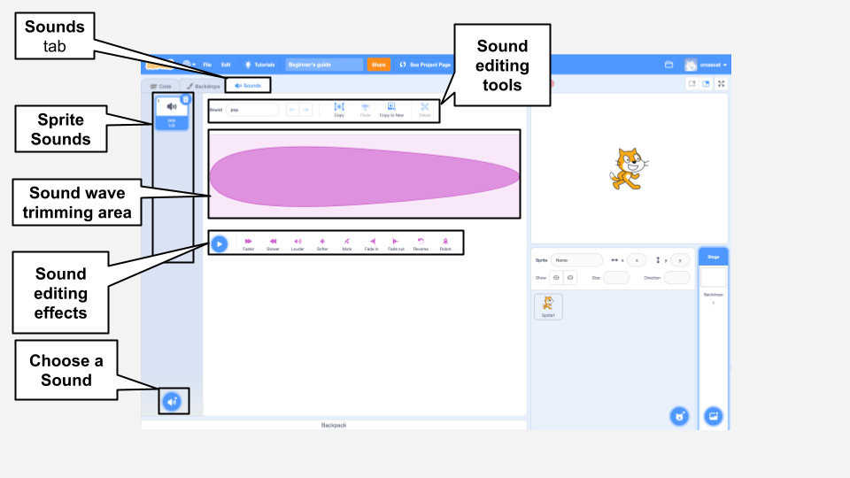
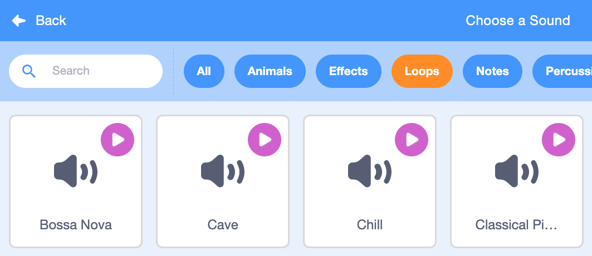

## Звук

Щоб додати звук твого проєкту, використовуй блоки`Звук`{:class="block3sound"}. Наприклад, ти можеш створити неперервний фоновий саундтрек, або додати звуки, які будуть звучати через певні інтервали часу.

{:width="600px"}

Спочатку вибери звук з бібліотеки звуків або запиши свій власний звук.

[[[scratch3-add-sound]]]

[[[scratch3-record-sound]]]

Додай код для запуску блоків `Звук`{:class="block3sound"} там, де тобі потрібен звук у твоєму проєкті.

--- collapse ---
---
title: Додавання тривалого звуку для створення безперервного саундтреку
---

Клацни на зелений прапорець, щоб послухати звуки.

**Саундтрек до радіо**: [Переглянути код](https://scratch.mit.edu/projects/444581851/editor){:target="_blank"}

<div class="scratch-preview">
 <iframe allowtransparency="true" width="485" height="402" src="https://scratch.mit.edu/projects/embed/444581851/?autostart=false" frameborder="0"></iframe>
</div>

Ти можеш скористатися блоком `відтворити звук до кінця`{:class="block3sound"}, який знаходиться всередині циклу `завжди`{:class="block3control"}. Після того, як звук закінчиться, цикл `завжди`{:class="block3control"} змусить звук відтворитися з самого початку.

У цьому коді використовується один довгий звук, який повторюється як саундтрек:

```blocks3
when green flag clicked
forever
play sound (Dance Snare Beat v) until done
end
```

**Порада:** При виборі нового звуку, якщо ти вибереш категорію **Фрагменти**, Scratch покаже тільки ті звуки, які підходять для одного зацикленого саундтреку.



--- /collapse ---

--- collapse ---
---
title: Додавання послідовності з коротких звуків для створення безперервної звукової доріжки
---

Клацни на зелений прапорець, щоб послухати звуки.

**Виступ Чемпіона**: [Переглянути код](https://scratch.mit.edu/projects/444673165/editor){:target="_blank"}

<div class="scratch-preview">
 <iframe allowtransparency="true" width="485" height="402" src="https://scratch.mit.edu/projects/embed/444673165/?autostart=false" frameborder="0"></iframe>
</div>

 Використовуй код `завжди`{:class="block3control"}, щоб створити зациклений звук. Ти можеш:
+ Виставити серію коротких звуків у певну послідовність, або
+ Використовувати різні інструментальні ноти та ефекти

```blocks3
when flag clicked
forever
play sound (Low Boing v) until done
play sound (Low Boing v) until done
play sound (Drum Buzz v) until done
play sound (Pop v) until done
play sound (Bird v) until done
play sound (Bark v) until done
play sound (Glug v) until done
End
```

--- /collapse ---

--- collapse ---
---
title: Додавання звуків, які звучать через однакові проміжки часу
---

**Футбольні звуки**: [Переглянути код](https://scratch.mit.edu/projects/450870079/editor){:target="_blank"}

Клацни на зелений прапорець, щоб послухати звуки.

<div class="scratch-preview">
 <iframe allowtransparency="true" width="485" height="402" src="https://scratch.mit.edu/projects/embed/450870079/?autostart=false" frameborder="0"></iframe>
</div>

 У цьому проєкті, **Сцена** має код для відтворення звуку через певні проміжки часу:

 ```blocks3
 when flag clicked
 forever
 wait (3) seconds
 play sound (Cheer v) until done
 end
 ```

Спрайт **Whistle** також відтворює звук через однакові інтервали часу:

 ```blocks3
 when this sprite clicked
 forever
 play sound (Referee Whistle v) until done
 wait (4) seconds
 end
 ```

--- /collapse ---

--- collapse ---
---
title: Додавання звуків, які будуть відтворюватись одночасно
---

Є два блоки `Звук`{:class="block3sound"} з суттєвою відмінністю:

+ Коли ти використовуєш блок `відтворити звук до кінця`{:class="block3sound"}, звук буде грати до кінця. Наступний фрагмент коду в скрипті не буде виконуватися до тих пір, поки не закінчиться відтворення звуку.

+ Коли ти використовуєш блок `відтворити звук`{:class="block3sound"}, звук буде грати, але наступний блок запуститься відразу і не буде чекати, поки звук закінчить грати.

Тобто, якщо у тебе є серія блоків `відтворити звук`{:class="block3sound"}, то всі звуки будуть грати майже одночасно, накладаючись один на одного. Ефект може бути цікавим, а іноді й безладним.

Спробуй як-небудь пограти з ним!

```blocks3
when green flag clicked
start sound (Meow v)
start sound (Alien Creak2 v)
start sound (Boing v)
start sound (Boom Cloud v)
start sound (Baa v)
```

--- /collapse ---

Після того, як ти вибрав свої звуки, ти можеш змінити ефекти `гучність`{:class="block3sound"}, `висота`{:class="block3sound"}, або `панорама`{:class="block3sound"} (щоб звук було чути з лівого або правого динаміка).

--- collapse ---
---
title: Гучність, висота тону та панорамування
---

Клацни на зелений прапорець, щоб послухати звуки.

**Практика в оркестрі**: [Переглянути код](https://scratch.mit.edu/projects/451697380/editor){:target="_blank"}

<div class="scratch-preview">
 <iframe allowtransparency="true" width="485" height="402" src="https://scratch.mit.edu/projects/embed/451697380/?autostart=false" frameborder="0"></iframe>
</div>

Спрайт **Drums** використовує блоки `встановити гучність`{:class="block3sound"}, `встановити ефект висота в`{:class="block3sound"}, або `встановити ефект панорама в`{:class="block3sound"}, щоб змінювати звук:

```blocks3
set volume to (80) %
set [pitch v] effect to (50) :: sound
set [pan left/right v] effect to (-100) :: sound
play sound (Drum Funky v) until done
```

+ Ти можеш `встановити гучність`{:class="block3sound"} на значення від `0` (silent) до `100` (повна гучність). Це корисно, якщо ти хочеш, щоб деякі звуки грали голосніше, ніж інші, або якщо ти хочеш, щоб спрайт відображався на більшій відстані.

+ Ефект `висота`{:class="block3sound"} контролює, наскільки високим або низьким є звук. Встановлення висоти тону на більше значення також робить звук швидшим. Ти можеш `встановити ефект висота в`{:class="block3sound"} у значення між `-360` (дуже низько) та`360` (дуже високо).

+ Ефект `pan left/right`{:class="block3sound"} дозволяє тобі налаштувати відтворення звуку з лівого чи правого динаміка або навушників, або з обох динаміків. Ти можеш `встановити ефект панорама в`{:class="block3sound"} в значення від `-100` (всі звуки зліва) до `100` (всі звуки справа).

--- /collapse ---

Також ти можеш використати розширення `Текст у мову`{:class="block3extensions"}:

[[[scratch3-text-to-speech]]]

